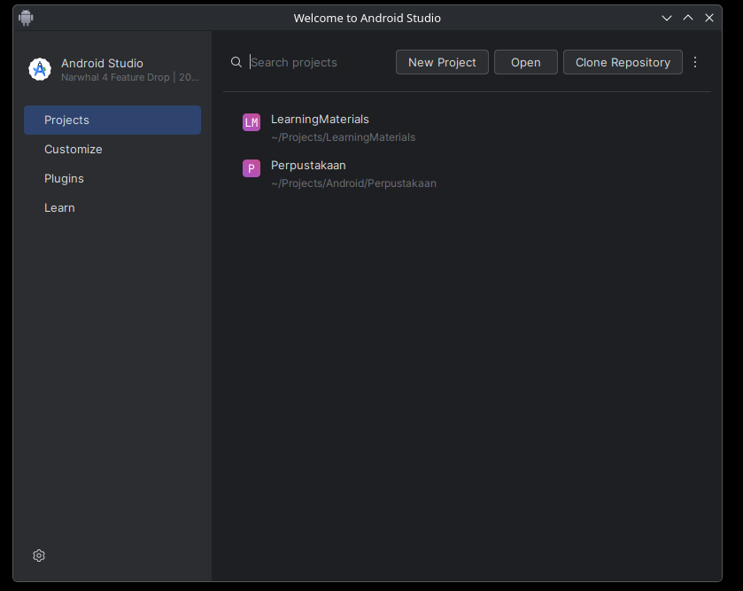
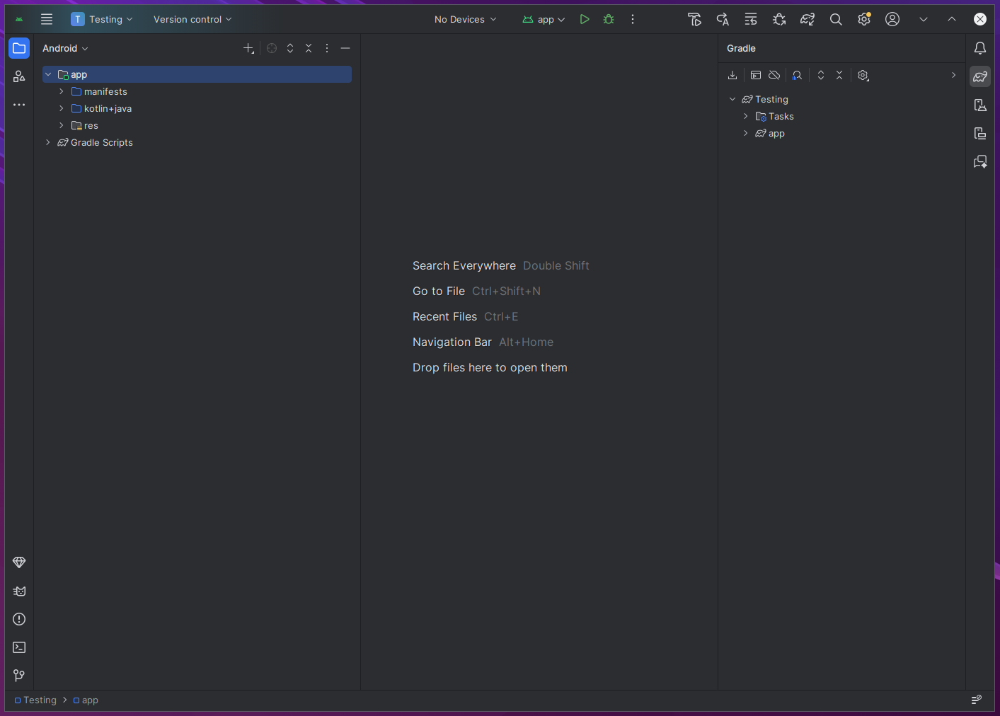
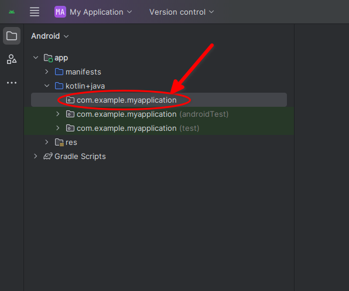
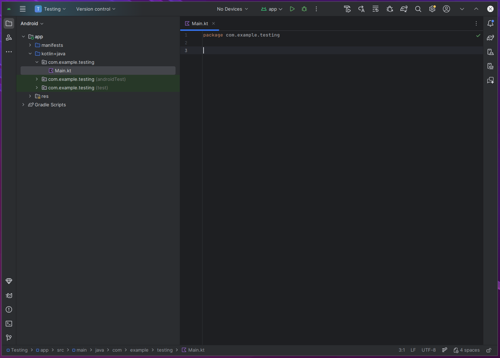

OUT OF DATE: NEEDS TO BE UPDATED FOR A COMPOSE PROJECT BECAUSE ANDROID STUDIO SUCKS AND WONT DO VANILLA KOTLIN CODE ANYMORE

# Creating A New Project

For programming the robot we use a text editor called Visual Studio Code, but for programming the scouting tablets, we use Android Studio. The short answer for why we do this is because Android Studio features all of the tools we need for programming the scouting tablets that Visual Studio Code does not have.

Let's start with creating an Android Studio project so we can have all of our code in one place.

1. Open up Android Studio. If you do not know where to find it, press the windows key on the keyboard and search for it using the search menu that pops up. The following image is what should open up.

> [!WARNING]
> If a previous project opens up automatically instead of something similar to the image above, then just double press shift, type in "close project" in the search box, and select the close project option to return to the project menu.

2. Click on the "New Project" button.
3. Select the "No Activity" option.
4. Click "Next"
5. In the name section, type in something you will remember. Don't worry about any of the other options for now.
6. Click the "Finish" button.

Now we wait until the project is done being created (this can take a while on the programming computers so be patient). Once done, you should see something similar to the following image.

Lastly, we need a file to write all of our code in.

1. To the left of the editor there should be a file explorer window with two folders, one being "app", and the other being "Gradle Scripts". We only care about the app one. Expand the app folder the same way as shown in the following image.

2. Right click the circled folder.
3. Select New and then Kotlin Class/File.
4. Select the file option.
5. Make the name "Main.kt" (this is case-sensitive) and then press enter.

And now we have a new project and a file to put all of our code in! The following picture is what your project should look like at the end.

