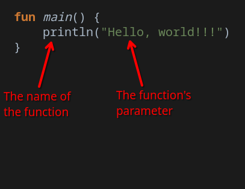

# Table Of Contents

 - Program entry point
 - Printing (Hello, world!)
 - Data types
 - Variables
 - Boolean logic
 - Conditionals
 - Loops
 - Functions
 - Lambdas
 - Null values

 - Creating a new project
 - Anatomy of a user interface
 - Composable functions
 - Layouts
 - State
 - Modifiers

 - Navigation
 - Databases

# The Program Entry Point

Let's start by asking the question: What code do we start with?

This answer is relatively simple for a programming language. Copy and paste the following code into the editor and click the "Run" button. After you do that, let's go over what this code does.

``` kotlin
fun main() {
    println("Hello, world!")
}
```

First things first, lets ignore this line in the middle `println("Hello, world")` and explain what all the fluff surrounding it is.

The code `fun main()` is what is called our program's entry point. It is where the computer is told to start executing our code. The curly brackets `{ }` following are the markers telling the computer where the code for our program's entry point is.

For now, we don't have to know exactly what all that means. The key takeaway is that whenever we want to write code in Kotlin, it must be inside those curly brackets following the `fun main()`.

Next, let's take a look at the line `println("Hello, world!")`.

The `println` part of this line is the name of a function called the "print line" function. All the stuff inside the following parentheses are known as that function's parameters. Simply put, the print line function takes its parameters and prints them to the console when it is executed. That is why when we run our program, we can see a console pop up with the text "Hello, world!".



> [!NOTE]
> When we use a function, we say we are "calling" that function. So in this case, we can say that we are calling the `println` function.

# Printing

In our first program, we call the `println` function. This is actually one of the most important functions to learn about when starting to code. This is because it is one of the easiest ways to help debug your code. So let's learn about how we can use this function.

We first printed some text to the console. To print plain text, we have to make sure that the text we are printing is inside double quotes `""`. Otherwise the computer will think we are trying to print something else and might break.

Right under our "Hello, world!" line, call the `println` function again and make it print a message of your choice.

Printing text is cool and all, but we can actually do a lot more than that. For example, Kotlin lets us perform mathematical calculations very easily. Replace the code inside your main function with the following code and then run it to see how this works.

``` kotlin
println(1 + 1)
println(10 - 15)
println(-2 * 8)
println(10 / 2)
```

So if we make our parameter some math instead of a message inside double quotes, we can print their results to the console. Kind of like a calculator.

The main takeaway here is that if we want to print a message, we surround our message in double quotes `""` and if we want to print some math, we just type out our math like it's a calculator.

But why is any of this important?

Simply put, we use the `println` function to test our code. When our code starts to get complicated and messy (it will), we may not know the value of certain things. This is where we can use the `println` function to see what that value is and make sure that everything is working as intended.

The last thing I would like to cover, before moving on to the more fun stuff, is putting comments in our code.

Before we even get to the point of having to print stuff to the console to understand what is going on in our code, we can write comments to document how our code works and make it easier to read.

So how do we put comments in our code? The answer is with double slashes `//`. In our code, everything past a pair of forward slashes will be considered a comment until the next line. If we want to write a comment that is going to span more a single line, we can instead use a forward slash followed by an asterisk `/*` to start a multi-line comment. To end a multi-line comment, we type an asterisk followed by a forward slash `*/`.

You don't have to copy and paste this code, but reading it is a good idea.

``` kotlin
/* This is a multi-line comment,
    everything in here is not going to be counted as code.
    Even if I write
    println("Hello, world!")
    it will not run.
*/

// This is a single line comment.

println(3.1415 * 2) // This will always be 2 pi.
```

# Data Types

Building on top of the different types of things we can print using the `println` function, there is a concept known as data types that we need to keep in mind.

| Type | Description |
| ---- | ----------- |
| Int  | An Int (integer) is what we refer to as whole numbers. It represents all numbers between infinity and negative infinity, but no numbers with decimal points like 2.2 or -10.07. |
| Double | A Double is what we refer to as a decimal number. It theoretically represents all numbers between infinity and negative infinity as well as numbers like 2.2 and -10.7. Behind the scenes, doubles can be quite complicated so just know that ideally, we should only be using these when we need the precision. |
| Boolean | A Boolean represents the values of true and false. We use these to represent states like being either on or off. There are also some calculations we can perform, specific to booleans, that make them very useful.
| String | A String is just a string of text. Kotlin only knows if text is actually a string if it is surrounded by double quotes. |

> [!NOTE]
> There are more types than what is listed here, but for now these are the most important ones that we will be getting familiar with.

For now, keep these in mind as we go into the next section.

# Variables

A variable in programming is kind of like a box that stores a value for you. In Kotlin, we specify the data type that the variable will hold, and then the value it will initially have. To create a variable, we use the `var` keyword to start. The following code is a template of how to create a variable.

``` kotlin
// To create a variable...
// var [variable name]: [data type] = [value to initialize the variable with]

// For example...
var myVariable: Int = 10

// Another example using another data type
var anotherOne: String = "This is a string!"

// Last example...
var lastExample: Boolean = false
```

Following the template, this code creates three different variables, but so far this does nothing. If we do want to do something with a variable, however, all we need to remember is it's name to access it.

``` kotlin
// Declaring a variable...
var moneyIHave: Int = 10

// Payday happens here...
moneyIHave = moneyIHave + 90

// Bought something stupid again...
moneyIHave = 10

// Using that variable to create another variable...
var moneyINeed: Int = moneyIHave * 10 // Multiply by 10

// Printing the content of moneyINeed to the console...
println(moneyINeed)
```

And lastly, what if there is a number or value that we want to remember, but we know is not going to change? Kotlin has an answer for this with something called a constant. It follows the exact same template as a variable, but instead of using the `var` keyword, we use the `val` keyword instead. This makes sure that when we create our constant, it will **not** be able to change anywhere in the code.

``` kotlin
// Example of creating a constant variable...
val pi: Double = 3.1415
val name: String = "Kong Qiu"
val serialNumber = "O-01-04(-W)"

// If we uncomment this, we get an error
// name = "Jia Qiu"
```

# Boolean Logic

Think back to math, basic arithmetic is stuff like adding, subtracting, multiplying and dividing. These are operations that involve calculations using integers or doubles. But let me ask a question that you might not care about... What other types of calculations can we do with the other data types?

With that preface out of the way, let's introduce the type of calculations we can do with the boolean data type.

Boolean values can only be either on or off, one or zero, true or false, and so on... We can't really do anything cool with operations like addition or subtraction, so instead we have a set of different calculations we can do called boolean logic. These are helpful for when we have multiple different boolean values and we want to do certain things when they are in certain states together. That might have been worded poorly, so let's get into the code.

``` kotlin
// Some lights in a room: true = on, false = off 
var lights: Boolean = false

// The the two switches in the room
var switchA: Boolean = false
var switchB: Boolean = false
```

Here we have 3 variables, two switches and one light. Let's try a couple different situation to show what boolean logic is and how to use it.

If we want to turn on the light when both switches are on, we use the `&&` AND operator.
If we want to turn on the light when either switch is on, we use the `||` OR operator.

| Operator | A | B | Result |
| -------- | - | - | ------ |
| AND (&&) | F | F | F      |
| AND (&&) | F | T | F      |
| AND (&&) | T | F | F      |
| AND (&&) | T | T | T      |
| OR  (\|\|) | F | F | F      |
| OR  (\|\|) | F | T | T      |
| OR  (\|\|) | T | F | T      |
| OR  (\|\|) | T | T | T      |

And if we want to reverse the state of a switch, we can use the `!` NOT operator.

| Operator | A | Result |
| -------- | - | ------ |
| NOT (!)  | F | T      |
| NOT (!)  | T | F      |

Finally, let's look at this in code...

``` kotlin
// Turn on the light if switchA AND switchB are on
switchA = true
switchB = false
lights = switchA && switchB // true && false == false
println(lights)

switchA = true
switchB = true
lights = switchA && switchB // true && true == true
println(lights)

// Turn on the light if switchA OR switchB is on
switchA = false
switchB = false
lights = switchA || switchB // false || false == false
println(lights)

switchA = true
switchB = false
lights = switchA || switchB // true || false == true
println(lights)

// Turn on the light if switchA is NOT on
switchA = true
lights = !switchA // !true == false
println(lights)

switchA = false
lights = !switchA // !false == true
println(lights)
```

And that's the gist of performing calculations with booleans. There is still a lot more depth to boolean logic, but for now this is enough to do some pretty cool stuff.

Lastly, what operations are there for the other data type that result in booleans?

Hopefully this part is fairly intuitive. If not, I promise to reiterate on this later.

| Operator | Description | Example |
| -------- | ----------- | ------- |
| == | Checks if two numbers (or any datatype) are equal to each other. | 10 == 10 is True |
| != | Checks if two numbers (or any datatype) are NOT equal to each other. | 10 != 10 is False |      
| > | Checks if the first number is greater than the second. | 10 > 5 is True |
| < | Checks if the first number is lesser than the second. | 10 < 5 is False |
| <= | Checks if greater than OR equal to. | 10 >= 10 is True, 10 >= 15 is False |
| >= | Checks if lesser than OR equal to. | 10 <= 10 is True, 10 <= 15 is True |

# Conditionals

If you have some programming experience, if statements are what are known as conditionals. Put simply: If something is true, do something. It is called a conditional because it requires a condition to be true in order to do something.

In Kotlin, the most basic form of a conditional is what is called an if statement. The following code is a basic template and example.

``` kotlin
// If statement template
// if ( [some boolean variable or expression] ) { [your code here] }

var lights: Boolean = true

// If the light is on, print to the console
if (lights) {
    println("The lights are on!")
}
```

To add on to this new concept, what if we want to do something if a condition is true and do something else if the condition is false?

Let me introduce the if-else statement.

``` kotlin
var lights: Boolean = false

// If lights are on, do something, otherwise do something else
if (lights) {
    println("This should never run!")
} else {
    println("The lights are NOT on!")
}
```

Hopefully that makes sense so far, but let's add on to this concept one last time. What if we want to chain a whole bunch of conditionals together? Let me finally introduce the else-if part of an if statement.

``` kotlin
var myNumber: Int = 10

// Checking if myNumber is less than, equal to, or greater than 5
if (myNumber == 5) {
    println("My number is 5")
} else if (myNumber < 5) {
    println("My number is less than 5")
} else if (myNumber > 5) {
    println("My number is greater than 5")
} else {
    println("Uh oh... something went wrong!")
}
```

One thing to note is that it is totally possible for multiple conditions to be true. But when the first condition to be true is reached, the code for that conditional is run and then the whole statement is exited.

And with that whirlwind tour of conditionals, we can now check the value of variables and do whatever we want based on that value.

# Loops

Alright, so let me ask this question now... What if we wanted to do something very repetitive, like loop the same code over and over until a condition is met? To do something like that, we can use what is called a `while` loop. Let's look at an example to get an idea of what I am talking about.

``` kotlin
var myNumber: Int = 0

// Let's loop until my number is 100 or something
// This checks if myNumber is less than 100,
// and if it is then the loop continues.
// If at any point, this condition is false, then
// the loop stops.
while (myNumber < 100) {
    // Here is the code that gets repeated for every loop
    // I am going to increment the number so eventually it will be greater than 100
    myNumber = myNumber + 1
    // Let's also print the value of myNumber to see this in action
    println(myNumber)
}

println("Done!")
```

Copy this code into your main function and then run it to see the loop in action.

So far, this is one type of loop: A loop that keeps going until a condition becomes false. In programming, there is another type of loop called a for loop. The purpose of this one  in Kotlin is not to loop until a condition is met, but to instead loop through a collection of something. Our previous example had us looping until our variable `myNumber` went from 0 to 100, but with a for loop we can actually simplify this process.

``` kotlin
// Loop through the numbers 0 to 99
// The last number is exlusive so it stops at the number before
for (i in 0..100) {
    println(i)
}
```

Let's go over what's going on here. First, inside the parenthesis we do not have a conditional like we have seen before. Instead this is a different syntax that declares the name of a variable, in this case `i`, that will represent every number in the loop.

The `0..100` is what we call a range. In short, this is actually data type just like how numbers and strings are data types, but these are used almost exlusively in for loops. The first number is your starting point, and the last number is the stopping point. Just make sure to remember that the range stops at the number before, 99 in this case.

Inside the for loop, we can use our variable `i` just like we normally would with the exception being that we cannot change it's value because the for loop does this for us.

That's cool and all, but is that it? The answer is (unfortunately) no. For loops are intended to loop through collections of things. So now is probably a good time to bring up the fact that in programming, we can actually create collections of variables. Kinda.

Let me ask this: What if we wanted to create a bunch of variables? Like, a lot of variables? We can do just that with something called an array.

``` kotlin
var arrayOfNumbers: Array<Int> = arrayof(1, 5, 9, 10, -27)
```

First, this code creates a variable of the array data type. This is different from all of the other data types because on it's own, it does not mean very much. It actually needs another data type so that Kotlin knows what we want to put *inside* of our array. In the example, we did this by putting the data type we want in the array inside of angle brackets after the `Array` data type.

Hopefully that makes sense so far. If not, thats ok. It's like 4AM right now because I got busy doing other stuff instead of writing this.

Anyways...

Here is an example of using a for loop to iterate over an array of values.

``` kotlin
// All of the names we want to do stuff with...
var names: Array<String> = arrayOf(
    "Gregor", "Rodion", "Sinclair", "Yi Sang",
    "Ishmael", "Heathcliff", "Don Quixote", "Hong Lu",
    "Ryoshu", "Meursault", "Outis", "Faust"
)

// Using a for loop to do stuff with these names...
for (name in names) {
    println(name + " is cool!")
}
```

Uhh that's pretty much it for loops I guess. I was gonna cover functions too, but like... that's a lot of work.

# Functions

...

# Lambda Functions

...

# Null Values

...

# Anatomy Of A User Interface

...

# Composable Functions

...

# Composable Layouts

...

# User Interface State

...

# Component Modifiers

...

# Navigation

...

# Databases

...

